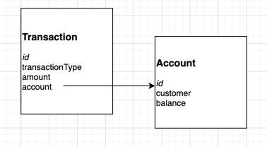

## Cash coding exercise

### Running tests instructions

There are 2 ways you can run this code;
1. Docker:
You need to install docker and run this command
 `docker build .`
   
2. Using your local setup:
[Install go](https://golang.org/doc/install),
   once done run `go test` in your project folder

   
### Design Concepts

This bank is made of accounts and transactions. Accounts have names and amounts for each customer. Every time a deposit or withdraw is done, the record is written in as a transaction and then the amount is reflected in the customer's account.
Transactions form a kind of ledger for the bank. 
In an ideal world the bank balance calculation and transactions would be events which would run as scheduled to create settlement files.

### Data Model 
Data model is very simple as shown below.

### Trade Offs/Assumptions
- All amounts are represented in cents and hence the type is integers.
- No concept of time or currency or statuses shown for this code.
- The id fields in the data model arent in this code. They'd be primary keys in a DB.
- Concurrency & race conditiona arent handled 